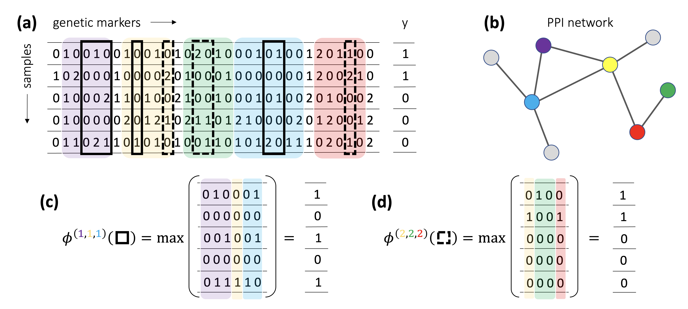

# HOGImine
HOGImine (Higher-Order Genetic Interaction miner), is a pattern-mining-based algorithm for finding genetic meta-markers, i.e. combinations of genetic markers, that show a statistical association with a phenotype.
Compared to the state-of-the-art miners, it expands the class of discoverable genetic meta-markers 
by considering higher-order interactions of genes and by allowing multiple encodings for the
genetic variants. Moreover, our method can exploit prior biological knowledge on
gene interactions, such as protein-protein interaction networks, genetic pathways and protein complexes,
to restrict its search space. HOGImine accepts both binary encodings and additive encodings for the markers.

|  |
|:--| 
| *Examples of meta-markers considered by HOGImine. **(a)** The dataset features, for each sample, a vector of genetic markers with additive encoding. The markers are subdivided into genes, in the figure highlighted by pale colors. **(b)** Information on the interactions among genes if usually provided via a PPI network. **(c)** The black solid meta-marker (shown in Panel a) spans three genomic intervals in the violet, yellow and azure genes, which form a connected subgraph in the network, using the dominant encoding for all three. **(d)** The black dashed meta-marker spans three genomic intervals in the yellow, green and red genes, which form a connected subgraph in the network, using the recessive encoding for all three.*|

### Citing our work 
HOGImine is described in the following paper:
> Paolo Pellizzoni, Giulia Muzio and Karsten Borgwardt. *Higher-order genetic interaction discovery with network-based biological priors.* ISMB 2023. [[PDF online]](https://academic.oup.com/bioinformatics/article/39/Supplement_1/i523/7210485?login=false) 


### Compilation
Compilation uses make. Currently the code is compiled with ```gcc-12```, but other compilers might work as well.
```
cd src
make
```

To decompress the SNP data in the *data/mmusculus* folder, use the following command. 
```
unzip data/mmusculus/BMC.Mode/BMC.Mode_X_T.txt.zip -d data/mmusculus/BMC.Mode/
```

### Options
The options for HOGImine are:
- ```-i file```: marker (binary or additive encoding) file. It should be matrix of size $n. SNPs \times n. samples$, i.e. with each column being a sample.
- ```-l file```: labels file. It should be a binary matrix of size $n. samples \times 1$.
- ```-s file```: SNP names file. It should be a file with $n. SNPs$ rows, containing the names of the SNPs.
- ```-c file```: covariate file. It should be a matrix of size $n. samples \times 1$ taking values in $\{ 1, \dots, C \}$, with $C$ being the number of covariate classes.
- ```-m file```: SNP map file. It should be a file with $n. genes$ rows. The first entry of each row should be the the gene name, and the following entries should be the SNPs that are mapped to that gene.
- ```-e file```: gene interactions file. It should be a file with $n. interactions$ rows. Each row should contain a set of genes that are known to be interacting (biological priors).
- ```-f level```: target fwer (e.g. 0.05).
- ```-o or -O file```: output file name, with -o in compressed format and with -O in verbose format.
- ```-p p```: number $p$ of permutations (default $0$), if $p > 0$ it runs a permutation testing procedure.
- ```-d d```: maximum SNP interval length in each gene.
- ```-v```: outputs all the testable patterns.


### Usage example (binary data)
```
./src/hogimine_additive -i data/athaliana/interactome_0kb/avrRpm1/avrRpm1_X.txt -l data/athaliana/interactome_0kb/avrRpm1/avrRpm1_Y.txt -c data/athaliana/covar_snps/avrRpm1/avrRpm1_covar_n2.txt -s data/athaliana/interactome_0kb/avrRpm1/avrRpm1_snpID.txt -m data/athaliana/interactome_0kb/avrRpm1/avrRpm1_snp_map.txt -e data/athaliana/athal_ppi/genes+edges+3cliques+complexes.txt -f 0.05 -O out_athaliana
```
Output: each pattern is reported on a row, the first column reports the CMH p-value of the pattern, then the interacting genes spanned by the pattern are reported, and finally the SNP positions composing the pattern.
```
3.27815e-12; AT3G07040, AT3G25070; Chr3_2227817, Chr3_9133148
1.33438e-11; AT3G07040; Chr3_2227817
2.22304e-11; AT3G07040, AT3G25070; Chr3_2227817, Chr3_9132644
2.22304e-11; AT3G07040, AT5G51450; Chr3_2227817, Chr5_20897395
...
```

### Usage example (additive data)
```
./src/hogimine_additive -i data/mmusculus/BMC.Mode/BMC.Mode_X_T.txt -l data/mmusculus/BMC.Mode/BMC.Mode_y_bin.txt -c data/mmusculus/BMC.Mode/BMC.Mode_kinship.txt -s data/mmusculus/BMC.Mode/SNPs_ids.txt -m data/mmusculus/BMC.Mode/gene2snps.txt -e data/mmusculus/BMC.Mode/all_int_compl.txt -f 0.05 -O out_mus
```

Output: each pattern is reported on a row, the first column reports the CMH p-value of the pattern, then the interacting genes spanned by the pattern are reported along with the encoding for the SNPs, and finally the SNP positions composing the pattern.

```
3.65197e-25; ENSMUSG00000047040 (dominant), ENSMUSG00000048175 (recessive); chr11_96928685, chr15_98155192
3.65197e-25; ENSMUSG00000047040 (dominant), ENSMUSG00000048175 (recessive); chr11_96930807, chr15_98157791
...
4.58913e-25; ENSMUSG00000061298 (dominant), ENSMUSG00000038756 (dominant); chr4_110873242, chr11_96148817
...
1.76405e-24; ENSMUSG00000057058 (dominant), ENSMUSG00000022148 (recessive); chr11_96573406, chr11_96584561, chr15_6571463
1.8372e-24; ENSMUSG00000018672 (dominant), ENSMUSG00000060992 (recessive); chr11_96859685, chr15_103292285
...
```